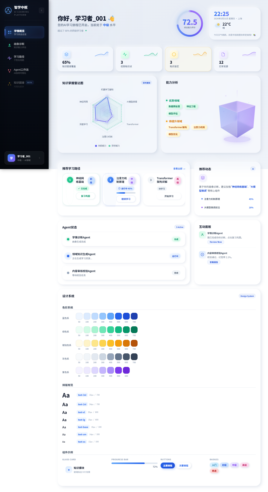
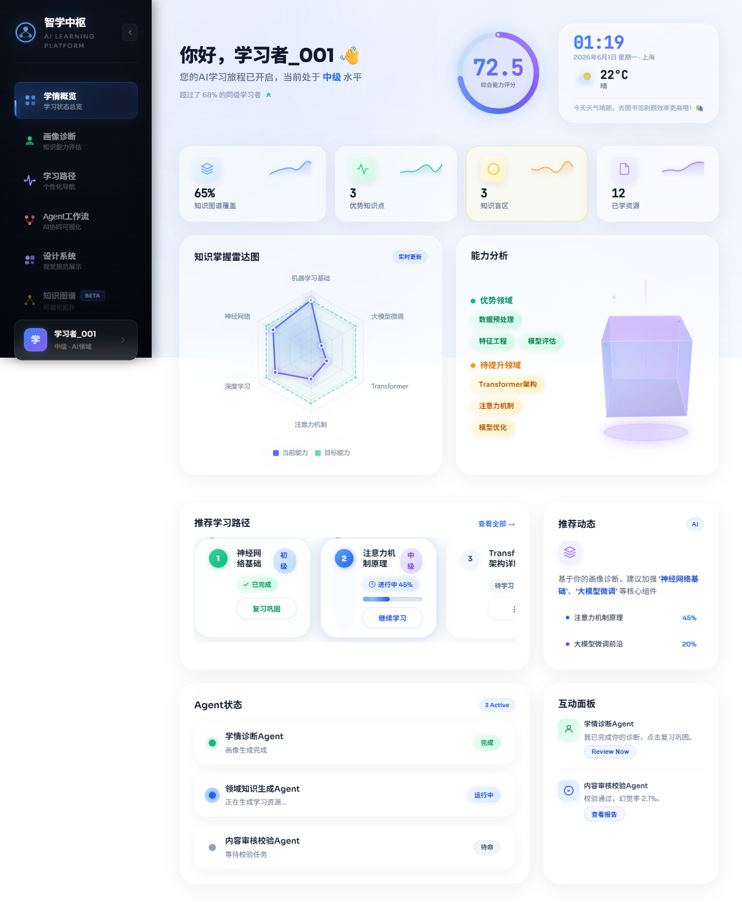
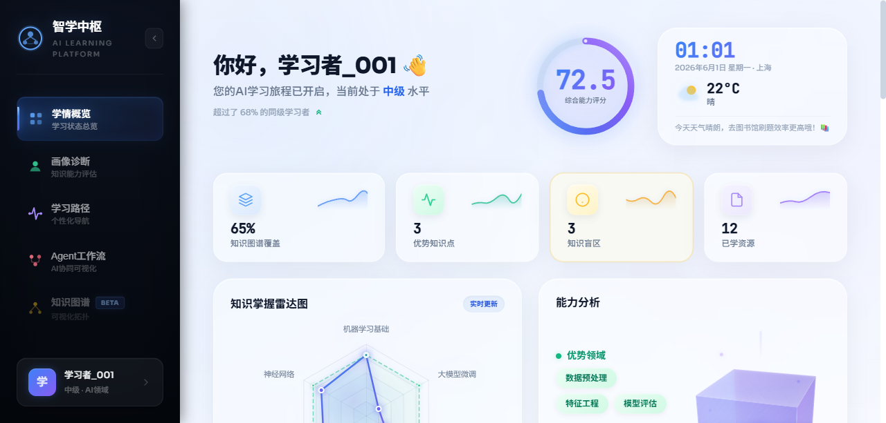
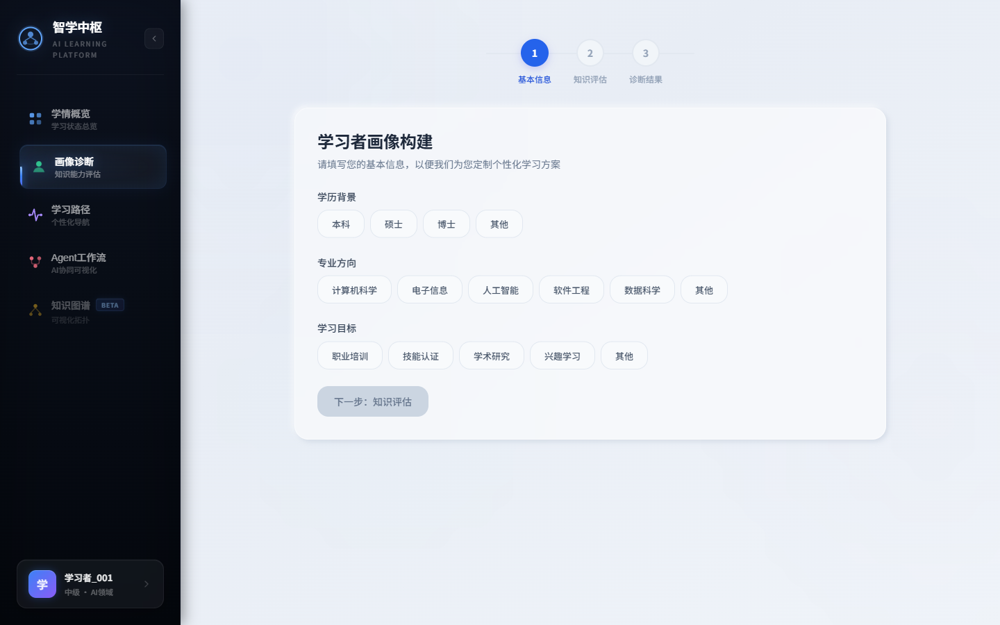
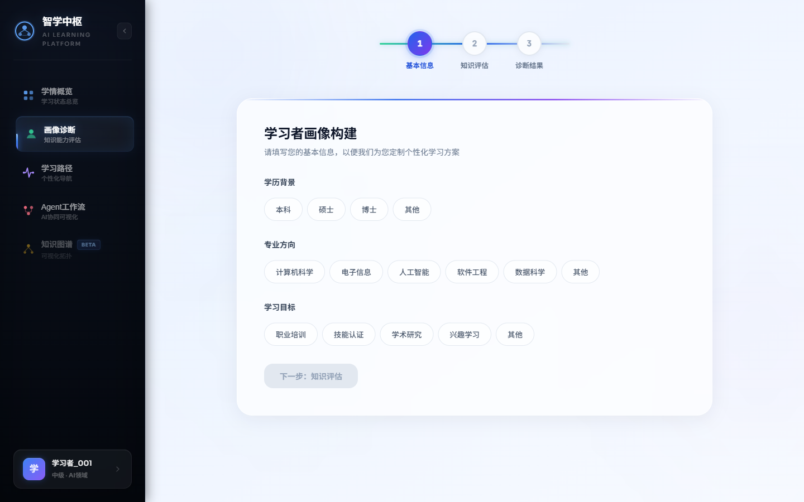
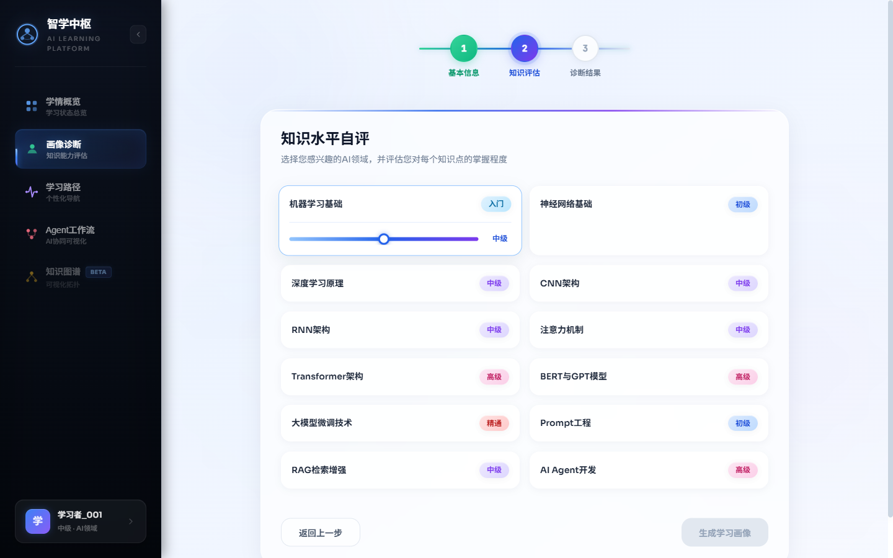
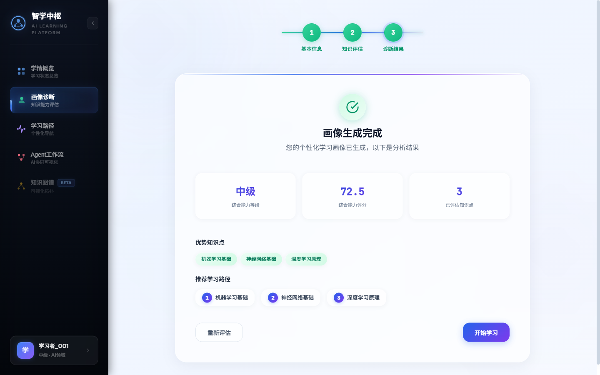
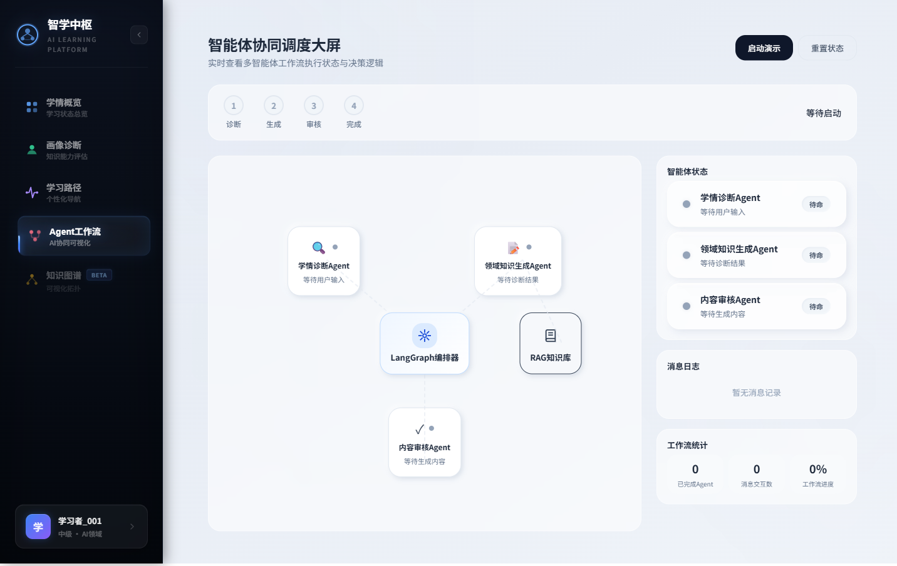
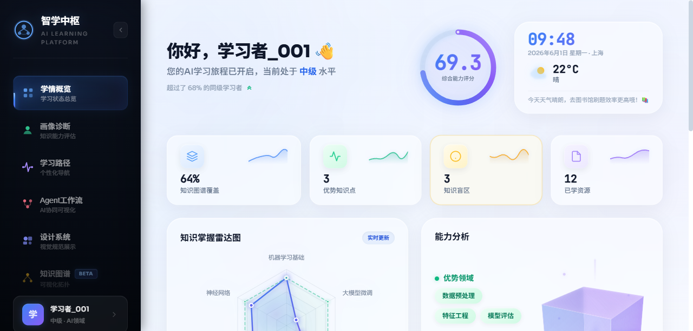
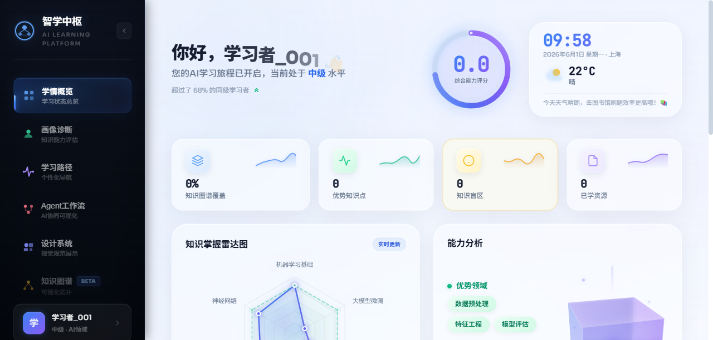

# 智学中枢 · 前端 V3.1 改前 / 改后对比

> 配套汇报：[[V3.1-前端升级汇报]](V3.1-前端升级汇报.md) ｜ 详细方案：[[V3.1-前端设计校准方案]](V3.1-前端设计校准方案.md)
> 截图取自实机（Vite dev @ localhost:3000），1440×900 视口。

---

## 一、学情概览 Dashboard（P0 字体 + P1 玻璃发光 + P4 数值仪表 + P5 抽离设计系统）

| 改前 | 改后 |
|:---:|:---:|
|  |  |
| 神拟态灰底、双向软阴影「黏土感」；系统回退字体；底部混入设计系统展示区 | 近白玻璃 + 蓝紫光晕；Sora/JetBrains 字体；数值等宽仪表化；设计系统已抽离，仅余业务内容 |

**数值仪表化特写（改后）**：`72.5` / `01:01` / `22°C` / `65%·3·12` 统一 JetBrains Mono + tabular-nums

---

## 二、画像诊断 ProfileBuilder（P2 · 当前最弱页补强）

| 改前 | 改后（步骤一） |
|:---:|:---:|
|  |  |
| 平白大卡、灰色方块控件、黑灰按钮、视觉密度低 | 玻璃卡 + 顶部光晕条；渐变步骤连接线 + 发光节点；Chip 选中蓝色发光；主按钮蓝紫渐变 |

**改后 · 知识自评（步骤二）**：玻璃知识点卡 + 选中蓝色光晕环 + 蓝紫渐变滑块

**改后 · 诊断结果（步骤四）**：玻璃统计卡（数值渐变 mono）+ 绿色发光完成图标 + 渐变编号路径

---

## 三、Agent 工作流 AgentWorkflow（P3 · 发光网络）

| 改前 | 改后 |
|:---:|:---:|
|  |  |
| 浅灰虚线连接、平白节点、黑灰按钮；RAG 配色 / error 态等令牌静默失效 | 蓝紫渐变发光连线（运行态流光粒子）；玻璃节点 + 激活 ping 波纹；RAG 紫色强调；按钮渐变；统计渐变 mono |

---

## 四、设计系统（P5 · 信息架构整理）

**改前**：「设计系统 / 排版规范 / 组件示例」混在学情概览底部（见上方 `01-dashboard-before` 截图最下方区块）。

**改后**：抽离为独立「设计系统」页面（侧边栏新增导航项），业务页不再承载设计文档。

---

## 五、GSAP 动效（G1–G3 · 动画中间帧）

> 动效为瞬时动画，下列为「冻结中间帧」截图（通过减速/暂停 GSAP 全局时间轴抓取）。

**G2 数值滚动（进行中）**：综合能力分 `69.3` 仍在向 72.5 滚动、知识图谱覆盖 `64%` 仍在向 65% 滚动 —— 证明 GSAP count-up 正在运行（非终值）。

**G3 标题逐字揭示（进行中）**：欢迎语尾部 `01`、👋 仍处于下移+淡入的揭示中段；此刻数值停在 0（揭示起始瞬间）。

**G1 Agent 连线发光网络**：MotionPath 粒子沿曲线连线流动（粒子为 1.7s 瞬时态，此图主要呈现精确曲线连线与发光网络）。

---

## 截图索引

| 文件 | 说明 |
|------|------|
| `screenshots/01-dashboard-before.png` | 学情概览 · 改前（神拟态 + 系统字体 + 含设计系统）|
| `screenshots/01-dashboard-after.png` | 学情概览 · 改后（玻璃发光 + mono + 已抽离）|
| `screenshots/01-dashboard-after-numbers.png` | 学情概览 · 数值仪表化特写 |
| `screenshots/02-profile-before.png` | 画像诊断 · 改前 |
| `screenshots/02-profile-after-step1.png` | 画像诊断 · 改后 · 基本信息 |
| `screenshots/02-profile-after-step2.png` | 画像诊断 · 改后 · 知识自评 |
| `screenshots/02-profile-after-result.png` | 画像诊断 · 改后 · 诊断结果 |
| `screenshots/03-workflow-before.png` | Agent 工作流 · 改前 |
| `screenshots/03-workflow-after.png` | Agent 工作流 · 改后 |
| `screenshots/04-designsystem-after.png` | 独立设计系统页面 · 改后 |
| `screenshots/g2-countup-mid.png` | GSAP G2 · 数值滚动中间帧（69.3 / 64%）|
| `screenshots/g3-splittext-mid.png` | GSAP G3 · 标题逐字揭示中间帧 |
| `screenshots/g1-particle-network.png` | GSAP G1 · Agent 发光网络（MotionPath 粒子）|
