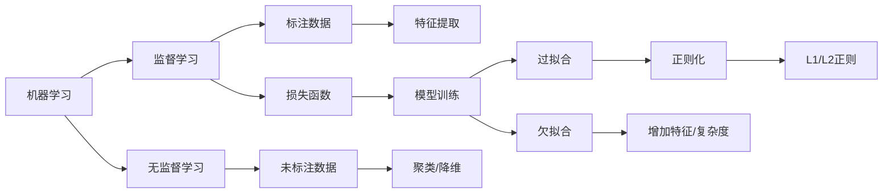

# 机器学习基础讲义

## ① 概念引入

机器学习要解决的核心问题是：**如何让计算机自动从数据中学习规律，而不是依靠人工编写规则**。传统编程中，我们需要为每一种情况手动编写判断逻辑，例如“如果温度高于30度，则开启空调”。但现实世界的问题往往复杂多变，比如识别一张图片里是猫还是狗，我们很难写出一个万能的规则集。机器学习正是为此而生——它让计算机通过分析大量数据，自己“悟”出其中的模式。

**直觉类比**：想象你是一位老师，要教会一个学生（模型）做数学题。你可以给他带标准答案的练习题（监督学习），让他做完后对照答案，错了就改正；也可以给他一堆没有答案的题目，让他自己整理出题型分类（无监督学习）；还可以让他通过不断尝试和获得反馈（强化学习）来学会解题策略。机器学习正是模仿了这种学习过程。

机器学习主要分为三大范式：
- **监督学习**：使用带标签的数据训练模型，就像学生做带标准答案的练习题。模型给出预测，与标准答案对照，错了就修正。
- **无监督学习**：从无标签数据中发现结构，像在没有答案的情况下自己整理笔记。
- **强化学习**：让智能体在与环境的交互中通过奖励信号学习策略。


![A comparative view of AI, Machine Learning, Deep Learning, and Generative AI. Through this comparative lens, the diagram illuminates the distinct features as well as their overlapping facets between these fields. This comparison shines a light on their unique characteristics and shared elements, enabling us to appreciate the interconnectedness and individuality of these concepts. This understanding is crucial in realizing the full potential of AI and its multifaceted aspects in current and future applications.](https://upload.wikimedia.org/wikipedia/commons/thumb/e/eb/Unraveling_AI_Complexity_-_A_Comparative_View_of_AI%2C_Machine_Learning%2C_Deep_Learning%2C_and_Generative_AI.jpg/960px-Unraveling_AI_Complexity_-_A_Comparative_View_of_AI%2C_Machine_Learning%2C_Deep_Learning%2C_and_Generative_AI.jpg)

*图片来源：[Wikimedia Commons](https://commons.wikimedia.org/wiki/File:Unraveling_AI_Complexity_-_A_Comparative_View_of_AI,_Machine_Learning,_Deep_Learning,_and_Generative_AI.jpg)（CC BY-SA 4.0）*

## ② 核心原理




*图：「机器学习基础」核心结构 / 流程示意（系统生成图解）*

### 特征与损失

**特征**是模型观察世界的窗口。在机器学习中，我们通常用一组数值来描述一个样本，这些数值就是特征。例如，预测房价时，房屋的面积、卧室数量、地理位置等就是特征。**特征工程**指从原始数据中构造、选择对预测有用的输入变量，特征的质量往往比模型的选择更能决定效果上限。

**损失函数**衡量预测与真实目标的差距，是模型优化的方向盘。训练过程就是不断调整参数让损失变小。常见的损失函数包括：
- **均方误差（MSE）**：用于回归任务，计算预测值与真实值之差的平方的平均值。
- **交叉熵**：用于分类任务，衡量预测概率分布与真实标签分布之间的差异。

### 监督学习与无监督学习

**监督学习**的典型任务包括：
- **分类**：预测离散的类别标签，例如判断一封邮件是否为垃圾邮件、识别图片中的物体类别。
- **回归**：预测连续的数值，例如预测房价或气温。

**无监督学习**的典型任务包括：
- **聚类**：把相似的样本自动分组，例如把用户按行为习惯分群。
- **降维**：在尽量保留信息的前提下压缩特征维度，便于可视化与后续建模。

### 过拟合与正则化

**过拟合**是指模型在训练数据上表现很好，但在新数据上表现很差。这就像学生死记硬背了练习题的答案，但遇到新题型就不会做了。过拟合通常发生在模型过于复杂（参数过多）或训练数据不足时。

**正则化**是防止过拟合的常用技术。它通过在损失函数中加入一个惩罚项，限制模型参数的大小，从而迫使模型学习更简单的模式。常见的正则化方法包括L1正则化和L2正则化。

**关键公式**（以线性回归为例）：
- 均方误差损失：$$L = \frac{1}{n}\sum_{i=1}^{n}(y_i - \hat{y}_i)^2$$
- 带L2正则化的损失：$$L = \frac{1}{n}\sum_{i=1}^{n}(y_i - \hat{y}_i)^2 + \lambda \sum_{j=1}^{m} w_j^2$$
  其中 $y_i$ 是真实值，$\hat{y}_i$ 是预测值，$w_j$ 是模型参数，$\lambda$ 是正则化强度。

## ③ 具体例子

### 监督学习例子：垃圾邮件分类
- **输入特征**：邮件中是否包含“免费”、“中奖”等关键词（二值特征），邮件长度，发件人域名等。
- **输出**：二分类标签（垃圾邮件/非垃圾邮件）。
- **损失函数**：交叉熵。如果模型预测某封邮件是垃圾邮件的概率为0.9，而实际标签是1（垃圾邮件），则损失较小；如果预测概率为0.1，则损失很大。

### 无监督学习例子：用户分群
- **输入特征**：用户的购买频率、平均消费金额、浏览时长等。
- **输出**：聚类后的群组编号（如“高消费活跃用户”、“低消费沉默用户”等）。
- **过程**：模型自动发现哪些用户的行为模式相似，并将它们归为一类，无需人工标注。

### 过拟合例子：房价预测
假设我们只有10个房屋样本，但使用了10次多项式回归（模型非常复杂）。模型会完美拟合所有训练样本，但用它预测新房屋的价格时，结果会非常离谱。这就是过拟合。加入L2正则化后，模型会倾向于使用更简单的曲线（如二次或线性），虽然训练误差可能稍大，但泛化能力更强。

## ④ 代码示例

以下是一个使用Python和scikit-learn库的简单线性回归示例，演示了特征、损失和正则化的基本概念。

```python
# 导入必要的库
import numpy as np
from sklearn.linear_model import LinearRegression, Ridge
from sklearn.metrics import mean_squared_error

# 输入：生成模拟数据
# 假设我们有一个特征 x 和目标 y，y 与 x 有线性关系并加入噪声
np.random.seed(42)
X = np.random.rand(100, 1) * 10  # 100个样本，1个特征，值在0-10之间
y = 2 * X + 1 + np.random.randn(100, 1) * 2  # 真实关系：y = 2x + 1 + 噪声

# 输出：训练一个线性回归模型（无正则化）
model = LinearRegression()
model.fit(X, y)
y_pred = model.predict(X)
loss = mean_squared_error(y, y_pred)
print(f"无正则化模型 - 均方误差: {loss:.4f}")
print(f"模型参数: 斜率={model.coef_[0][0]:.4f}, 截距={model.intercept_[0]:.4f}")

# 输出：训练一个带L2正则化的岭回归模型（Ridge）
ridge_model = Ridge(alpha=1.0)  # alpha是正则化强度λ
ridge_model.fit(X, y)
y_pred_ridge = ridge_model.predict(X)
loss_ridge = mean_squared_error(y, y_pred_ridge)
print(f"带正则化模型 - 均方误差: {loss_ridge:.4f}")
print(f"模型参数: 斜率={ridge_model.coef_[0][0]:.4f}, 截距={ridge_model.intercept_[0]:.4f}")

# 输出说明：
# 无正则化模型会尽量拟合所有数据点，参数可能较大。
# 带正则化的模型会惩罚大参数，因此斜率可能更小，但泛化能力更强。
```

## ⑤ 常见误区

1. **特征越多越好**：实际上，特征质量比数量更重要。冗余或无关特征会增加模型复杂度，导致过拟合。特征工程的核心是选择对预测有用的输入变量。

2. **训练误差越小，模型越好**：这是过拟合的典型表现。模型可能在训练集上完美拟合，但在测试集上表现很差。应该监控训练曲线，判断是否欠拟合或过拟合。

3. **正则化强度越大越好**：正则化强度（如 $\lambda$）过大，会导致模型过于简单，无法捕捉数据中的规律（欠拟合）。通常需要调参找到合适的平衡点。

4. **所有问题都用监督学习**：当没有标签数据时，无监督学习（如聚类、降维）是更好的选择。例如，用户分群、异常检测等场景。

5. **学习率固定不变**：通常先用学习率扫描找到合适量级，再叠加调度与正则。批大小、学习率与训练轮数需要联合调整。

## ⑥ 小结

本讲义覆盖了机器学习的基础核心概念：

- **监督学习**：使用带标签数据，解决分类和回归问题。损失函数（如均方误差、交叉熵）是优化的方向盘。
- **无监督学习**：从无标签数据中发现结构，典型任务包括聚类和降维。
- **特征**：模型观察世界的窗口，特征质量决定效果上限。
- **损失函数**：衡量预测与真实的差距，训练过程就是最小化损失。
- **过拟合**：模型在训练集上表现好但泛化差，通常由模型复杂或数据不足引起。
- **正则化**：通过惩罚大参数防止过拟合，常用L1和L2正则化。

这些概念是机器学习的基石，理解它们有助于后续学习更复杂的模型（如神经网络、大语言模型）和技术（如迁移学习、参数高效微调）。

<!-- media:enriched -->